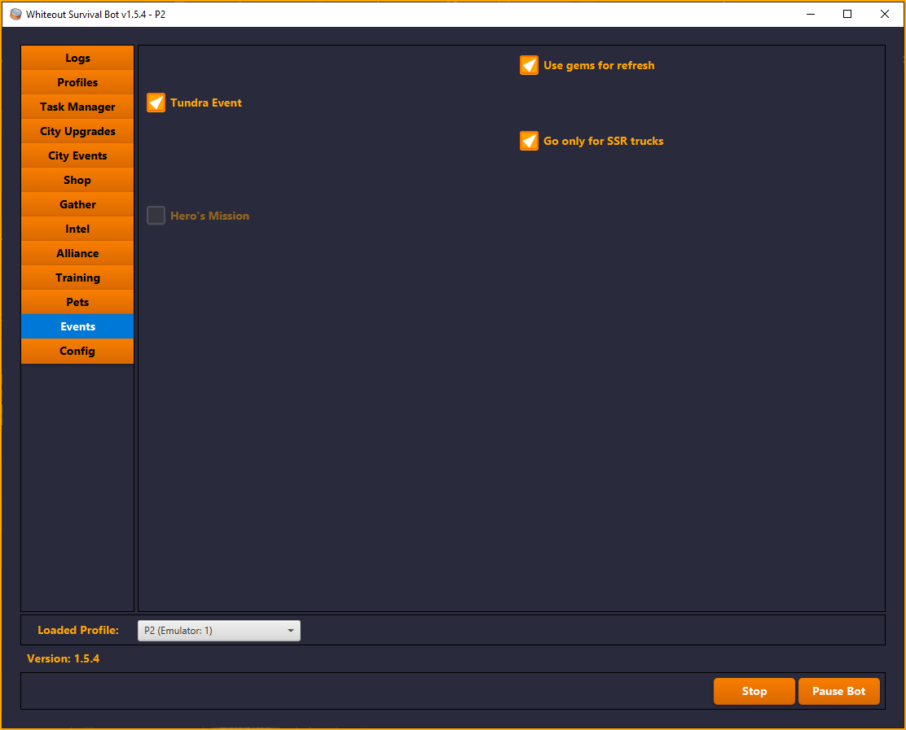

# Whiteout Survival Bot

[](https://buymeacoffee.com/cearivera1z)
[](https://discord.gg/Wk6YSr6mUp)

A bot for automating tasks in **Whiteout Survival**. This project is a work in progress and is developed in my free time. If you have any requests or suggestions, feel free to ask. I will try to respond as soon as possible.

---

## 📌 Current Features

- ✅ Multi-profile support (run multiple accounts simultaneously)
- ✅ **Arena** battles
- ✅ **Polar Terror** hunting
- ✅ **Trains and promotes troops**
- ✅ **Intel**
- ✅ **"My Trucks"** section of the **Tundra Truck Event**
- ✅ **Experts**
- ✅ **Tundra Trek** (random options)
- ✅ **Tundra Trek Supplies**
- ✅ **Journey of Light**
- ✅ **Pet Adventure**
- ✅ **Pet Skills** (Food, Treasure, and Stamina)
- ✅ **Gathers** resources
- ✅ **Daily Shards** from the **War Academy**
- ✅ **Fire Crystals** from the **Crystal Laboratory**
- ✅ **Nomadic Merchant**
- ✅ **Online Rewards**
- ✅ **Hero Recruitment**
- ✅ **Exploration Chests**
- ✅ **Daily VIP Points**
- ✅ **Mail**
- ✅ **Alliance Tech**
- ✅ **Alliance Chests**
- ✅ **Alliance Rallies**

---
## 🎬 Video Showcase

[](https://www.youtube.com/watch?v=Nnjv68xiIV0)

---

## 📸 Screenshots

| | | |
|:----------------------------------------------------------:|:----------------------------------------------------------:|:----------------------------------------------------------:|
|  |  |
|  |  | 
|  |  |
|  |  |
|  |  |
|  |  |
|  |

---


## 🛠️ How to Compile & Run

### 1️⃣ Install Requirements

* **Java (JDK 17 or newer)**
  👉 Download from [Adoptium Temurin](https://adoptium.net/)

* **Apache Maven** (for building the project)
  👉 Download from [Maven official site](https://maven.apache.org/install.html)

### 2️⃣ Add to PATH (Windows Users)

After installing, you need to add **Java** and **Maven** to your environment variables:

1. Press **Win + R**, type `sysdm.cpl`, and press **Enter**.
2. Go to **Advanced → Environment Variables**.
3. Under **System variables**, find `Path`, select it, and click **Edit**.
4. Add the following entries (adjust if installed in a different folder):

   ```
   C:\Program Files\Eclipse Adoptium\jdk-17\bin
   C:\apache-maven-3.9.9\bin
   ```
5. Click **OK** and restart your terminal (or reboot if needed).

✅ Verify installation:

```sh
java -version
mvn -version
```

### 3️⃣ Compile the Project

In the project’s root folder, run:

```sh
mvn clean install package
```

This will generate a `.jar` file inside the **`wos-hmi/target`** directory.
Example:

```
wos-hmi/target/wos-bot-1.5.4.jar
```

### 4️⃣ Run the Bot

#### ✅ Recommended: Run from Command Line

This way you can see real-time logs (useful for debugging).

```sh
# Navigate to the target directory
cd wos-hmi/target

# Run the bot (replace X.X.X with the version you built)
java -jar wos-bot-X.X.X.jar
```

#### With a Double-Click
You can also run the bot by double-clicking the `wos-bot-x.x.x.jar` file. Note that this will not display a console for logs.

### 5️⃣ Emulator setup — choose the correct executable

Supported emulators: MuMu Player, MEmu, LDPlayer 9.

When the launcher asks you to choose your emulator executable, select the command-line controller for your emulator (not the graphical player app). Below are the executables you should select for each supported emulator, with typical default paths on Windows:

- MuMu Player
  - Executable: MuMuManager.exe
  - Default path: `C:\Program Files\Netease\MuMuPlayerGlobal-12.0\shell\`
                  `C:\Program File\Netease\MuMuPlayer\nx_main\`
- MEmu
  - Executable: memuc.exe
  - Default path: `C:\Program Files\\Microvirt\MEmu\`

- LDPlayer 9
  - Executable: ldconsole.exe
  - Default path: `C:\LDPlayer\LDPlayer9\`

Notes:
- If your emulator is installed in a different location, browse to the folder where that executable resides and select it.
- These executables provide command-line control so the bot can launch/close instances and detect whether they are running.
- LDPlayer only: You must manually enable ADB in the instance settings (Settings → Other settings → ADB debugging = Enable local connection), otherwise the bot cannot connect via ADB.

#### Instance settings

The bot is designed to run on MuMu Player with the following settings:
- Resolution: 720x1280 (320 DPI) (mandatory)
- CPU: 2 Cores
- RAM: 2 GB
- Game Language: English (mandatory)

Note: For best performance and reliability, disable the Snowfall and Day/Night Cycle options in the in-game settings, and avoid using Ultra graphics quality.

---

### 🚀 Future Features (Planned)
- 🔹 **Beast Hunt**
- 🔹 **Alliance Mobilization**
- 🔹 **Fishing Event**
- 🔹 **And more...** 🔥

---

